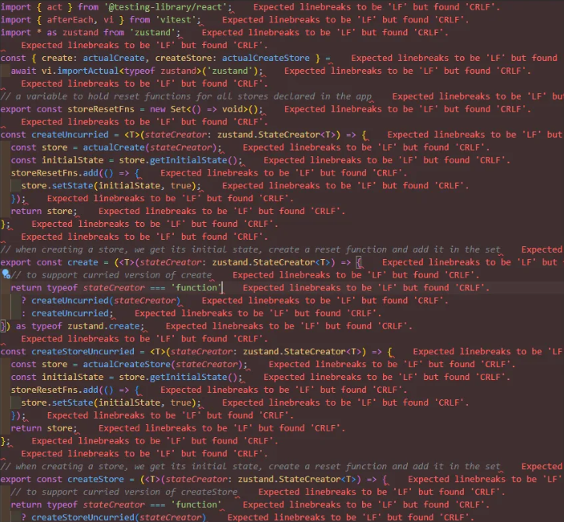
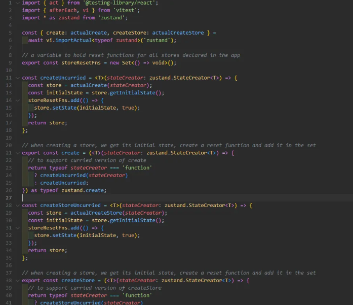
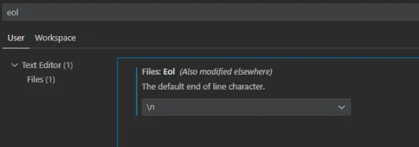

## 배경



맥에서 구축된 프론트 프로젝트를 윈도우에서 켰을 때 보통 보이는 사진이다.

전체 화면에 빨갛게 오류로 나오니 정신 나갈 것 같다.

## 문제정의

### CRLF와 LF가 무엇인가?

줄바꿈 방식의 차이라고 생각하면 된다.

윈도우는 `/r/n`, 맥, 리눅스는 `\n` 으로 줄바꿈 처리를 진행한다.

그래서 윈도우는 `CR` + `LF` == `\r` + `\n` 로 표시하는 것이고,

맥과 리눅스는 `LF` == `\n` 으로 표기하는 것이다.

> 줄바꿈, line break, EOL(End Of Line)

### 왜 이런 일이 일어났을까?

나는 윈도우에서 이 프로젝트를 깃으로 받아 vs code로 켰다.

그러나 이 프로젝트는 맥에서 만들어진 프로젝트였지만, 깃에 올렸을 때 `LF` 형식으로 올리지 않아서 생긴 이슈로 판단된다.

### 저 에러는 어디서 내뱉는 걸까?

이 에러는 `eslint`에서 내뱉는 것이다. 그래서 `.eslintrc.cjs` 파일을 열어 설정 중 `linebreak-style` 내용을 확인해보자.

```
{
  'linebreak-style': ['error', 'unix']
}
```

### CRLF와 LF 중 무엇을 선택해야하는가?

가장 고민되는 사실일 것이다. 그러나 정답은 거의 정해져있다.

1. `\r\n`과 `\n`은 바이트 크기 차이가 있다.
2. 리눅스나 맥에서 `\r`은 줄바꿈 오류로 실행된다.
3. `LF`는 표준이다.

즉, LF를 사용하자.

## 행동

### CRLF를 LF로 변경하자

- Prettier를 이용하여 전체 파일의 `CRLF`를 `LF`로 변경시킬 것이다.

1. Prettier 설치 확인

   ```sh
   npx prettier -v
   ```

2. 버전이 출력되지 않는다면, Prettier 설치

   ```sh
    npx install --save-dev prettier
   ```

3. .prettierrc 파일 생성, LF 설정 적용

   ```json
   {
     "endOfLine": "lf"
   }
   ```

4. 설치한 Prettier를 이용하여 모든 파일을 적용한다.

   ```sh
   npx prettier --write .
   ```



### 예방방법

1. VSCode 설정

VSCode 설정(crtl + ,)으로 들어가 eol을 검색한다.



이곳에서 `\n`으로 기본값을 변경한다.

2. Git 커밋 설정

```sh
  git config --global core.autocrlf false
  git config --global core.eol lf
```

## 결과

CRLF와 LF의 차이를 알고 한꺼번에 처리하는 방법과 예방 방법을 알아보았다~
